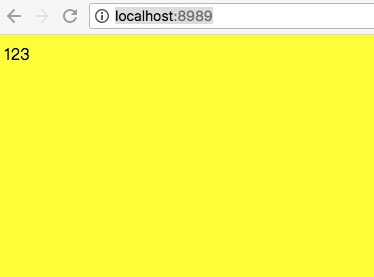
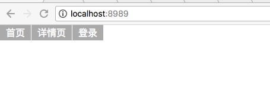
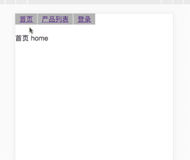
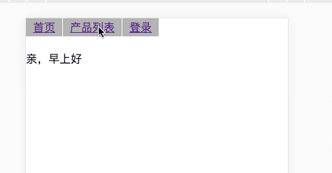

[参考](https://segmentfault.com/q/1010000012086401)

### 案例1

新建项目
```
[demo]
  |-- index.html
  |-- package.json
  |-- webpack.config.js
  |-- src
    |-- entry.js
    |-- entry.less
```

<font color="deeppink">demo/package.json</font>
```json
{
  "name": "demo",
  "version": "1.0.0",
  "description": "",
  "main": "index.js",
  "entry": {
    "index": "./src/entry.js"
  },
  "scripts": {
    "start": "dora --plugins webpack,proxy",
    "build": "atool-build"
  },
  "author": "",
  "license": "ISC",
  "devDependencies": {
    "atool-build": "^1.0.2",
    "dora": "^0.5.0",
    "dora-plugin-proxy": "^0.8.5",
    "dora-plugin-webpack": "^1.0.0",
    "react": "^16.2.0",
    "react-dom": "^16.2.0",
    "react-redux": "^5.0.7",
    "react-router": "^4.2.0",
    "react-router-dom": "^4.2.2",
    "redux": "^3.7.2",
    "redux-thunk": "^2.2.0"
  },
  "dependencies": {
    "jquery": "^3.3.1"
  }
}
```

<font color="deeppink">demo/webpack.config.js</font>
```js
var webpack = require('atool-build/lib/webpack');

module.exports = function(webpackConfig) {
  // 拷贝html
  module.exports = function(webpackConfig) {
    webpackConfig.module.loaders.push({ test: /\.html$/, loader: 'file?name=[name].[ext]' })
    return webpackConfig;
  };
  // 删除common
  webpackConfig.plugins.some(function(plugin, i){
    if(plugin instanceof webpack.optimize.CommonsChunkPlugin || plugin.constructor.name === 'CommonsChunkPlugin') {
      webpackConfig.plugins.splice(i, 1);
      return true;
    }
  });
  // 返回 webpack 配置对象
  return webpackConfig;
};
```

<font color="deeppink">demo/index.html</font>
```html
<!DOCTYPE html>
<html lang="en">
<head>
  <meta charset="UTF-8">
  <title>webpackDemo</title>
  <meta content="width=device-width, initial-scale=1.0, maximum-scale=1.0, user-scalable=0" name="viewport">
  <link rel="stylesheet" href="./index.css">
</head>
<body>
  <div id="root"></div>
</body>
<script src="./index.js"></script>
</html>
```

<font color="deeppink">demo/src/entry.js</font>
```jsx
import React from 'react';
import ReactDOM from 'react-dom';
import './entry.less';

class Init extends React.Component {
  render() {
    return (
      <div>123</div>
    )
  }
}

ReactDOM.render(
  <Init />,
  document.getElementById('root'),
);
```

<font color="deeppink">demo/src/entry.less</font>
```less
body {
  background: yellow;
}
```

$ tnpm i

$ npm start

http://localhost:8989/



新增如下
```
[demo]
  |-- src
    |-- routers
      |-- index.js
    |-- components
      |-- menuBar
        |-- menuBar.js
        |-- menuBar.less
```

<font color="deeppink">demo/src/components/menuBar/menuBar.js</font>
```js
import React from 'react';
import './menuBar.less';

export default class MenuBar extends React.Component  {
  render() {
    return (
      <div>
        <ul className="menu-bar">
          <li>首页</li>
          <li>详情页</li>
          <li>登录</li>
        </ul>
      </div>
    )
  }
}
```

<font color="deeppink">demo/src/components/menuBar/menuBar.less</font>
```less
.menu-bar {
  height: 50px;
  li {
    float: left;
    padding: 5px 10px;
    margin-right: 1px;
    color: #fff;
    background: #aaa;
  }
}
```

<font color="deeppink">demo/src/routers/index.js</font>
```js
import { HashRouter, Route } from 'react-router-dom';
import MenuBar from '../components/menuBar/menuBar';
import React from 'react';

const Routes = () =>
  <HashRouter>
    <Route path="/" component={MenuBar} />
  </HashRouter>;

export default Routes;
```

<font color="deeppink">demo/src/entry.js</font>
```js
import React from 'react';
import ReactDOM from 'react-dom';
import { hashHistory } from 'react-router';
import './entry.less';
import Routes from './routers/index'

ReactDOM.render(
  <Routes />,
  document.getElementById('root'),
);
```

<font color="deeppink">demo/src/entry.less</font>
```less
html, body, div, span, applet, object, iframe,
h1, h2, h3, h4, h5, h6, p, blockquote, pre,
a, abbr, acronym, address, big, cite, code,
del, dfn, em, img, ins, kbd, q, s, samp,
small, strike, strong, sub, sup, tt, var,
b, u, i, center,
dl, dt, dd, ol, ul, li,
fieldset, form, label, legend,
table, caption, tbody, tfoot, thead, tr, th, td,
article, aside, canvas, details, embed, 
figure, figcaption, footer, header, hgroup, 
menu, nav, output, ruby, section, summary,
time, mark, audio, video {
	margin: 0;
	padding: 0;
	border: 0;
	font-size: 100%;
	font: inherit;
	vertical-align: baseline;
}
/* HTML5 display-role reset for older browsers */
article, aside, details, figcaption, figure, 
footer, header, hgroup, menu, nav, section {
	display: block;
}
body {
	line-height: 1;
}
ol, ul {
	list-style: none;
}
blockquote, q {
	quotes: none;
}
blockquote:before, blockquote:after,
q:before, q:after {
	content: '';
	content: none;
}
table {
	border-collapse: collapse;
	border-spacing: 0;
}
```




新增
```
[demo]
  |-- src
    |-- components
      |-- home
        |-- home.js
        |-- home.less
      |-- product
        |-- product.js
        |-- product.less
      |-- login
        |-- login.js
        |-- login.less
```

<font color="deeppink">demo/src/components/home/home.js</font>
```jsx
import React from 'react';

export default class Home extends React.Component  {
  render() {
    return (
      <div>
        首页 home
      </div>
    )
  }
}
```

<font color="deeppink">demo/src/components/product/product.js</font>
```jsx
import React from 'react';
import './product.less';

export default class Product extends React.Component  {
  render() {
    return (
      <div className="product-wrap">
        <h2>产品列表页面</h2>
        <ul className="product-list">
          <li>产品1</li>
          <li>产品2</li>
          <li>产品3</li>
        </ul>
      </div>
    )
  }
}
```

<font color="deeppink">demo/src/components/product/product.less</font>
```less
.product-wrap {
  h2 {
    padding-bottom: 30px;
    font-size: 20px;
    text-align: center;
  }
  .product-list {
    li {
      padding: 10px 20px;
      border-bottom: 1px solid #ddd;
    }
  }
}
```

<font color="deeppink">demo/src/components/login/login.js</font>
```jsx
import React from 'react';
import './login.less';

export default class Login extends React.Component  {
  render() {
    return (
      <div className="login-wrap">
        <h2 className="line">登录页面</h2>
        <div className="line">
          <label>用户名</label>
          <input />
        </div>
        <div className="line">
          <label>密码</label>
          <input />
        </div>
        <p className="btn">登录</p>
      </div>
    )
  }
}
```

<font color="deeppink">demo/src/components/login/login.less</font>
```less
.login-wrap {
  margin: 20px;
  padding: 10px;
  border: 1px solid #ddd;
  border-radius: 10px;
  h2 {
    text-align: center;
  }
  label {
    display: inline-block;
    width: 80px;
    padding-right: 20px;
    text-align: right;
  }
  input {
    width: 200px;
    border: 1px solid #ddd;
  }
  .btn {
    width: 50px;
    margin: 0 auto;
    padding: 5px 0;
    color: #fff;
    text-align: center;
    background: #aaa;
  }
  .line {
    margin-bottom: 10px;
  }
}
```

<font color="deeppink">demo/src/components/menuBar/menuBar.js</font>
```js
import React from 'react';
import { Link } from 'react-router-dom';
import './menuBar.less';

export default class MenuBar extends React.Component  {
  render() {
    return (
      <div>
        <ul className="menu-bar">
          <li><Link to="/">首页</Link></li>
          <li><Link to="/product">产品列表</Link></li>
          <li><Link to="/login">登录</Link></li>
        </ul>
        {this.props.children}
      </div>
    )
  }
}
```

<font color="deeppink">demo/src/routers/index.js</font>
```js
import { HashRouter, Route, Switch } from 'react-router-dom';
import React from 'react';
import MenuBar from '../components/menuBar/menuBar';
import Home from '../components/home/home';
import Product from '../components/product/product';
import Login from '../components/login/login';

const Routes = () =>
  <HashRouter>
    <MenuBar>
      <Route path="/" exact component={Home} />
      <Route path="/product" exact component={Product} />
      <Route path="/login" exact component={Login} />
    </MenuBar>
  </HashRouter>;

export default Routes;
```



新建
```
[demo]
  |-- src
    |-- reducers
      |-- index.js
      |-- homeReducer.js
      |-- productReducer.js
```

<font color="deeppink">demo/src/reducers/homeReducer.js</font>
```js
const initialState = {
  welcome: '亲，早上好',
};

export default (state = initialState, action) => {
  switch (action.type) {
    case 'GET_INIT':
      return {
        ...state,
        ...action.payload,
      };
    default:
      return state;
  }
};
```

<font color="deeppink">demo/src/reducers/productReducer.js</font>
```js
const initialState = {
  listName: '产品列表',
  productList: [],
};

export default (state = initialState, action) => {
  switch (action.type) {
    case 'GET_LIST':
      return {
        ...state,
        productList: action.payload,
      };
    default:
      return state;
  }
};
```

<font color="deeppink">demo/src/reducers/index.js</font>
```js
import { combineReducers } from 'redux';
import homeReducer from './homeReducer';
import productReducer from './productReducer';

const rootReducer = combineReducers({
  home: homeReducer,
  product: productReducer,
});

export default rootReducer;
```

<font color="deeppink">demo/src/routers/index.js</font>
```js
import { HashRouter, Route, Switch } from 'react-router-dom';
import React from 'react';
import thunk from 'redux-thunk';
import { Provider } from 'react-redux';
import { createStore, applyMiddleware } from 'redux';
import reducer from '../reducers/index';
import MenuBar from '../components/menuBar/menuBar';
import Home from '../components/home/home';
import Product from '../components/product/product';
import Login from '../components/login/login';

const store = createStore(reducer, applyMiddleware(thunk));

const Routes = () =>
  <Provider store={store}>
    <HashRouter>
      <MenuBar>
        <Route path="/" exact component={Home} />
        <Route path="/product" exact component={Product} />
        <Route path="/login" exact component={Login} />
      </MenuBar>
    </HashRouter>
  </Provider>;

export default Routes;
```

<font color="deeppink">demo/src/components/home/home.js</font>
```js
import React from 'react';
import { connect } from 'react-redux';
import './home.less';

class Home extends React.Component  {
  render() {
    const {
      welcome
    } = this.props.home;
    return (
      <div>
        {welcome}
      </div>
    )
  }
}

function mapStateToProps(state) {
  return {
    home: state.home,
  };
}

export default connect(mapStateToProps)(Home);
```


<font color="deeppink">demo/src/components/product/product.js</font>
```js
import React from 'react';
import { connect } from 'react-redux';
import './product.less';
class Product extends React.Component  {
  render() {
    const {
      productList = []
    } = this.props.product;
    return (
      <div className="product-wrap">
        <h2>产品列表页面</h2> 
        <ul className="product-list">
          {
            productList.map(v => (
              <li>{v.desc}</li>
            ))
          }
        </ul>
      </div>
    )
  }
}

function mapStateToProps(state) {
  return {
    product: state.product,
  };
}

export default connect(mapStateToProps)(Product);
```



新建
```
[demo]
  |-- proxy.config.js
  |-- src
    |-- base
      |-- ajax.js
    |-- actions
      |-- index.js
      |-- homeAction.js
      |-- productAction.js
```

<font color="deeppink">demo/src/base/ajax.js</font>
```js
import $ from 'jquery';

function noop() {}

export default function ajax(opts = {}) {
  const {
    url,
    type = 'GET',
    timeout = 5000,
    data,
    ok = noop,
    fail = noop,
    cm = noop,
  } = opts;
  $.ajax({
    url,
    type,
    dataType: 'json',
    cache: false,
    timeout,
    data,
    success(d) {
      if (d.stat === 'ok') {
        ok(d);
      } else {
        fail({
          d,
          type: 'statFail',
        });
      }
    },
    error(d) {
      fail({
        d,
        type: 'ajaxError',
      });
    },
    complete() {
      cm();
    },
  });
}
```

<font color="deeppink">demo/proxy.config.js</font>
```js
module.exports = {
  'GET /init': {
    stat: "ok",
    data: {
      'welcome': '蓝蓝，早上好'
    }
  },
  'GET /list': {
    stat: "ok",
    data: [
      {
        'desc': '产品1'
      },
      {
        'desc': '产品2'
      },
      {
        'desc': '产品3'
      },
    ]
  },
};
```

<font color="deeppink">demo/src/actions/homeAction.js</font>
```js
import ajax from '../base/ajax';

export const homeInit = () => (dispatch) => {
  ajax({
    url: '/init',
    ok: (response) => {
      dispatch({type: 'GET_INIT', payLoad: response.data});
    },
  });
}
```


<font color="deeppink">demo/src/actions/productAction.js</font>
```js
import ajax from '../base/ajax';

export const listShow = () => (dispatch) => {
  ajax({
    url: '/list',
    ok: (response) => {
      dispatch({type: 'GET_LIST', payload: response.data});
    },
  });
}
```

<font color="deeppink">demo/src/actions/index.js</font>
```js
import * as homeAction from './homeAction';
import * as productAction from './productAction';

export default {
  ...homeAction,
  ...productAction,
}
```

<font color="deeppink">demo/src/components/home/home.js</font>
```js
import React from 'react';
import { connect } from 'react-redux';
import { bindActionCreators } from 'redux';
import Actions from '../../actions/index';
import './home.less';

class Home extends React.Component  {
  componentDidMount() {
    this.props.action.homeInit();
  }
  render() {
    const {
      welcome
    } = this.props.home;
    return (
      <div>
        {welcome}
      </div>
    )
  }
}

function mapStateToProps(state) {
  return {
    home: state.home,
  };
}

function mapDispatchToProps(dispatch) {
  return {
    action: bindActionCreators(Actions, dispatch)
  }
};

export default connect(mapStateToProps, mapDispatchToProps)(Home);
```

<font color="deeppink">demo/src/components/product/product.js</font>
```js
import React from 'react';
import { connect } from 'react-redux';
import { bindActionCreators } from 'redux';
import Actions from '../../actions/index';
import './product.less';

class Product extends React.Component {
  componentDidMount() {
    this.props.action.listShow();
  }
  render() {
    const {
      productList = []
    } = this.props.product;
    return (
      <div className="product-wrap">
        <h2>产品列表页面</h2> 
        <ul className="product-list">
          {
            productList.map((v, i) => (
              <li key={i}>{v.desc}</li>
            ))
          }
        </ul>
      </div>
    )
  }
}

function mapStateToProps(state) {
  return {
    product: state.product,
  };
}

function mapDispatchToProps(dispatch) {
  return {
    action: bindActionCreators(Actions, dispatch)
  }
};

export default connect(mapStateToProps, mapDispatchToProps)(Product);
```


<font color="deeppink">demo/src/actions/loginAction.js</font>
```js
import ajax from '../base/ajax';

export const userLogin = (data) => (dispatch) => {
  ajax({
    url: '/login',
    data,
    ok: (response) => {
      dispatch({type: 'GET_LOGIN', payload: {
        userInfo: response.userInfo,
        isLogin: true
      }});
    },
  });
}
```

<font color="deeppink">demo/src/actions/index.js</font>
```js
import * as homeAction from './homeAction';
import * as productAction from './productAction';
import * as loginAction from './loginAction'

export default {
  ...homeAction,
  ...productAction,
  ...loginAction,
}
```

<font color="deeppink">demo/src/reducers/loginReducer.js</font>
```js
const initialState = {
  userInfo: {},
  isLogin: false,
};

export default (state = initialState, action) => {
  switch (action.type) {
    case 'GET_LOGIN':
      return {
        ...state,
        ...action.payload,
      };
    default:
      return state;
  }
};
```

<font color="deeppink">demo/src/reducers/index.js</font>
```js
import { combineReducers } from 'redux';
import homeReducer from './homeReducer';
import productReducer from './productReducer';
import loginReducer from './loginReducer';

const rootReducer = combineReducers({
  home: homeReducer,
  product: productReducer,
  login: loginReducer,
});

export default rootReducer;
```

<font color="deeppink">demo/src/components/login/login.js</font>
```js
import React from 'react';
import { connect } from 'react-redux';
import { bindActionCreators } from 'redux';
import Actions from '../../actions/index';
import './login.less';

class Login extends React.Component {
  login() {
    const userVal = this.user.value;
    const pswVal = this.psw.value;
    console.log(userVal, pswVal)
    if (userVal && pswVal) {
      this.props.action.userLogin({
        username: userVal,
        password: pswVal
      });
      alert('登录成功')
    } else {
      alert('用户名或密码不能为空')
    }
  }
  render() {
    return (
      <div className="login-wrap">
        <h2 className="line">登录页面</h2>
        <div className="line">
          <label>用户名</label>
          <input ref={(e) => { this.user = e; }}/>
        </div>
        <div className="line">
          <label>密码</label>
          <input ref={(e) => { this.psw = e; }} />
        </div>
        <p className="btn" onClick={() => this.login()}>登录</p>
      </div>
    )
  }
}

function mapStateToProps(state) {
  return {
    login: state.login,
  };
}

function mapDispatchToProps(dispatch) {
  return {
    action: bindActionCreators(Actions, dispatch)
  }
};

export default connect(mapStateToProps, mapDispatchToProps)(Login);
```


<font color="deeppink">demo/src/actions/loginAction.js</font>
```js
import ajax from '../base/ajax';

// 登录
export const userLogin = (data) => (dispatch) => {
  ajax({
    url: '/login',
    data,
    ok: (response) => {
      dispatch({type: 'GET_LOGIN', payload: {
        userInfo: response.userInfo,
        isLogin: true
      }});
    },
  });
}

// 退出登录
export const userCheckout = (data) => (dispatch) => {
  dispatch({type: 'GET_LOGIN', payload: {
    userInfo: {},
    isLogin: false
  }});
}
```

<font color="deeppink">demo/src/components/login/login.js</font>
```js
import React from 'react';
import { connect } from 'react-redux';
import { bindActionCreators } from 'redux';
import { withRouter } from 'react-router-dom';
import Actions from '../../actions/index';
import './login.less';

class Login extends React.Component {
  login() {
    const userVal = this.user.value;
    const pswVal = this.psw.value;
    if (userVal && pswVal) {
      this.props.action.userLogin({
        username: userVal,
        password: pswVal
      });
    } else {
      alert('用户名或密码不能为空')
    }
  }
  componentDidUpdate() {
    const { isLogin } = this.props.login;
    if ( isLogin ) {
      this.props.history.push('/');
    }
  }
  render() {
    return (
      <div className="login-wrap">
        <h2 className="line">登录页面</h2>
        <div className="line">
          <label>用户名</label>
          <input ref={(e) => { this.user = e; }}/>
        </div>
        <div className="line">
          <label>密码</label>
          <input ref={(e) => { this.psw = e; }} />
        </div>
        <p className="btn" onClick={() => this.login()}>登录</p>
      </div>
    )
  }
}

function mapStateToProps(state) {
  return {
    login: state.login,
  };
}

function mapDispatchToProps(dispatch) {
  return {
    action: bindActionCreators(Actions, dispatch)
  }
};

export default withRouter(connect(mapStateToProps, mapDispatchToProps)(Login));
```


<font color="deeppink">demo/src/components/menuBar/menuBar.js</font>
```js
import React from 'react';
import { connect } from 'react-redux';
import { bindActionCreators } from 'redux';
import { Link, withRouter } from 'react-router-dom';
import Actions from '../../actions/index';
import './menuBar.less';

class MenuBar extends React.Component  {
  checkout() {
    this.props.action.userCheckout();
  }
  render() {
    const { isLogin } = this.props.login;
    return (
      <div>
        <ul className="menu-bar">
          <li><Link to="/">首页</Link></li>
          <li><Link to="/product">产品列表</Link></li>
          {
            !isLogin && <li><Link to="/login">登录</Link></li>
          }
          {
            isLogin && <li onClick={() => this.checkout()}>退出</li>
          }
        </ul>
        {this.props.children}
      </div>
    )
  }
}

function mapStateToProps(state) {
  return {
    login: state.login,
  };
}

function mapDispatchToProps(dispatch) {
  return {
    action: bindActionCreators(Actions, dispatch)
  }
};

export default withRouter(connect(mapStateToProps, mapDispatchToProps)(MenuBar));
```


<font color="deeppink">demo/src/components/home/home.js</font>
```js
import React from 'react';
import { connect } from 'react-redux';
import { bindActionCreators } from 'redux';
import Actions from '../../actions/index';
import './home.less';

class Home extends React.Component  {
  componentDidMount() {
    this.props.action.homeInit();
  }
  render() {
    const {
      home,
      login,
    } = this.props;
    const {
      welcome
    } = home;
    const {
      userInfo,
      isLogin,
    } = login;
    const {
      username,
      email,
      tel,
    } = userInfo;
    return (
      <div>
        {isLogin ? `${username}，欢迎来到主页` : welcome}
        {
          isLogin && <div>
            <p>个人信息</p>
            <div><label>邮箱：</label>{email}</div>
            <div><label>电话：</label>{tel}</div>
          </div>
        }
      </div>
    )
  }
}

function mapStateToProps(state) {
  return {
    home: state.home,
    login: state.login
  };
}

function mapDispatchToProps(dispatch) {
  return {
    action: bindActionCreators(Actions, dispatch)
  }
};

export default connect(mapStateToProps, mapDispatchToProps)(Home);
```


<font color="deeppink">demo/proxy.config.js</font>
```js
module.exports = {
  'GET /init': {
    stat: "ok",
    data: {
      'welcome': '蓝蓝，早上好'
    }
  },
  'GET /list': {
    stat: "ok",
    data: [
      {
        'desc': '产品1'
      },
      {
        'desc': '产品2'
      },
      {
        'desc': '产品3'
      },
    ]
  },
  'GET /login': {
    stat: 'ok',
    userInfo: {
      username: '蓝北鼻',
      tel: 123456789,
      email: 'lanbeibi@163.com',
    }
  },
  'GET /detail': {
    stat: 'ok',
    detail: '产品描述如下'
  }
};

```


<font color="deeppink">demo/src/actions/productAction.js</font>
```js
import ajax from '../base/ajax';

export const listShow = () => (dispatch) => {
  ajax({
    url: '/list',
    ok: (response) => {
      dispatch({type: 'GET_LIST', payload: response.data});
    },
  });
}

export const detailShow = () => (dispatch) => {
  ajax({
    url: '/detail',
    ok: (response) => {
      dispatch({type: 'GET_DETAIL', payload: response.detail});
    },
  });
}
```

<font color="deeppink">demo/src/reducers/productReducer.js</font>
```js
const initialState = {
  listName: '产品列表',
  productList: [],
  detail: '',
};

export default (state = initialState, action) => {
  switch (action.type) {
    case 'GET_LIST':
      return {
        ...state,
        productList: action.payload,
      };
    case 'GET_DETAIL': {
      return {
        ...state,
        detail: action.payload,
      }
    }
    default:
      return state;
  }
};
```

<font color="deeppink">demo/src/components/product/product.js</font>
```js
import React from 'react';
import { connect } from 'react-redux';
import { bindActionCreators } from 'redux';
import Actions from '../../actions/index';
import './product.less';

class Product extends React.Component {
  componentDidMount() {
    this.props.action.listShow();
  }
  detail(v) {
    const {isLogin} = this.props.login;
    if (isLogin) {
      this.props.action.detailShow();
    } else {
      this.props.history.push('/login');
    }
  }
  render() {
    const {
      product,
      login,
    } = this.props;
    const {
      productList = [],
      detail,
    } = product;
    const {isLogin} = login;
    return (
      <div className="product-wrap">
        <h2>产品列表页面</h2> 
        <ul className="product-list">
          {
            productList.map((v, i) => (
              <li key={i}>{v.desc} <span onClick={() => this.detail(v)}>点击查看详情</span></li>
            ))
          }
        </ul>
        <br />
        {
          isLogin && detail && <p>{detail}</p>
        }
      </div>
    )
  }
}

function mapStateToProps(state) {
  return {
    login: state.login,
    product: state.product,
  };
}

function mapDispatchToProps(dispatch) {
  return {
    action: bindActionCreators(Actions, dispatch)
  }
};

export default connect(mapStateToProps, mapDispatchToProps)(Product);
```


